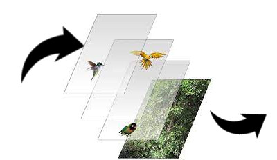

# Slice 2 Dice

## Présentation

Je veux faire un jeu de team building à la façon de *Slice & Dice*. En utilisant Pygame.

## Fonctionnalités 

Le joueur exécute le fichier python `main.py`. Une magnifique fenêtre s'ouvre alors face a lui. La bibliothèque **Pygame** nous permet d'ouvrir cette fenêtre et d'afficher des rectangles colorées.

## Changelog

### V0.6 : 

* Ajouts des boutons, pour le menu
    * Création d'un effet de survol de la souris quand elle passe sur le bouton
    

### V0.5 : 

* Codage d'images dans une scène.
* Rectangles transparents permis

* Création de la classe personnage
    * Ajout d'un lien avec les scenes
    * Incorporation de cette classe aux fonctions d'affichage
    * Affichage des classes personnages (cadre, fond, sprite)
    * Fonction tels que `set_vie()`, `vie_baisser()` et `vie_aumenter()` ou `mort()` sont ajouté à la classe

* Création de la classe ennemi qui est similaire à la classe personnage.
    * Affichage des ennemis possible

* Réarangement des dossiers images :
    * Ajout de nombreux présets d'images poue le dev (Sprite) et pour mettre une image aux personnages
    * Ajout d'images de backgrouds (Background)
    * Déplacement des images de documentation (Documentation)

### V0.4 :

* Création de scènes différentes, "combat" et "menu".

* Implémentation d'un changement de scène par le trigger d'un appuie sur une touche.
    * Permettre un changement instantané et avec les scènes affichés correctement.

### V0.3 :

* Changement de TAD pour l'affichage, utilisation d'une file pour afficher le premier élément, que l'on aurai introduit en premier dans la file, **FIFO** (*First In First Out*)

* On définis la priorité d'affichage comme étant le degré qui détermine quel est l'objet a afficher en premier, plus la priorité est faible, plus ce sera le premier a être traité, donc le premier dans la file "d'impression".

* On ajoute l'élément dans la file directement la où il devrais être, par rapport à sa priorité donc on n'a pas besoin d'une fonction qui trierai la file

### V0.2 :

* Création de deux modules différents :
    * Affichage qui gère une fonction affiche(scène), qui va afficher les élément de la scène.
    * TAD implémentant différents types de TAD.
* Le TAD utilisé est une pile qui permettra la mise en place de priorité/ordre d'affichage dse éléments d'une scène, plus le calque est en bas dans la pile, plus il sera affiché au premier plan, donc en dernier **FILO** (*First In Last Out*)

### V0.1 :

* Le programme est en mesure d'ouvrir une fenêtre et de la fermer
* On code des rectangles qui vont être définis/positionnés par la scène 1, on implémente la class Rectangle et Scène.

## Roadmap, Idées 

* Finnaliser le menu
    * Ajout d'une classe bouton

* Immaginer des attaques
* Créer une classe personnages :
    * Créer une foncion affichant les points de vie
    * Créer les attaques liées aux personnages

*etc...*
***
